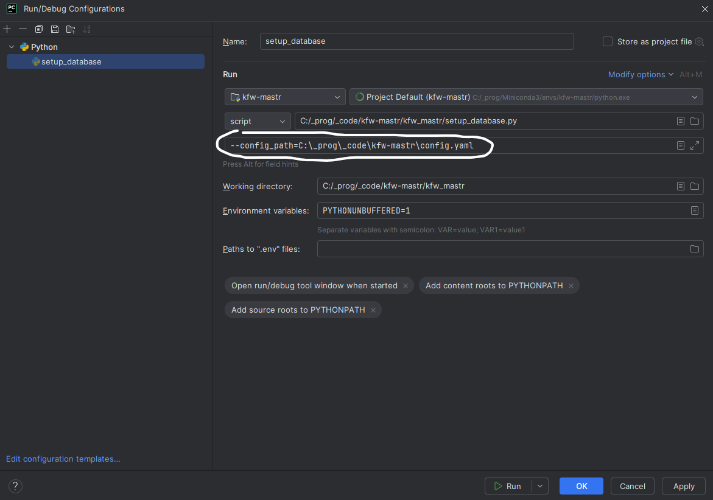

# kfw-mastr
Model renewable energy power 

## :wrench: Installation and setup environment

Follow the steps [here](/docs/setup_and_install.md) to setup the project.

## Run programme

:warning: The following steps assume that the previous steps have been performed already successfully - specifically:
* Docker postgre database created successfully
* Marstammdatenregister imported into database
* German municipalities imported into database
* Calculation tables for wind and solar are successfully created

### Step-by-step guide to run programme

#### :one: Starting docker container

Docker needs to be started before the programme can run successfully. <br>
On Windows just start `Docker Desktop` (might need to be started with administrator rights, if problems occur) and start the docker container.

#### :two: Configure and start programme

##### :green_book: Working with terminal or command line

1. Make sure [python path](docs/setup_and_install.md#3-set-python-path) is set correctly to REPO_ROOT
2. Make sure no other scripts are running within kfw-mastr, as they will block the deletion of `kfw-mastr.log` and yield an unclean exported log.
3. Configure [config.yaml](config.yaml) for the run. Visit the [`Config.yaml documentation`](#configyaml-documentation) below for more setting details and how to use config.yaml.
4. Run 
```
python main.py
```
Optional: Define path to config.yaml
```
python main.py --config_path "C:\Users\user\your\favourite\path\config_file_can_have_any_name.yaml"
```

##### :orange_book: Working with an integrated development environment (IDE) [e.g. Pycharm or Visual Studio Code]

1. Set `kfw-mastr` as environment in your IDE
2. Make sure no other scripts are running within kfw-mastr, as they will block the deletion of `kfw-mastr.log` and yield an unclean exported log.
3. Configure [config.yaml](config.yaml) for the run. Visit the [`Config.yaml documentation`](#configyaml-documentation) below for more setting details and how to use config.yaml.
4. Run 
```
python main.py
```
Optional: Define path to config.yaml in `Script parammeters`: `--config_path=C:\_prog\_code\kfw-mastr\config.yaml`




### Config.yaml documentation
For running the programme you can use a yaml file to configure the run in `config.yaml`:

| Variable             | Value                                      | Default             | Example                                             | Explanation                                                                                                                                                                    |
|----------------------|--------------------------------------------|---------------------|-----------------------------------------------------|--------------------------------------------------------------------------------------------------------------------------------------------------------------------------------|
| REPO_ROOT            | "C:\\Users\\user\\user\\Python\\kfw-mastr" | Error if not set    |                                                     | Specify path to cloned repo.                                                                                                                                                   |
| NUMBER_THREADS       | "4"                                        | "4"                 | "32"                                                | Specify number of threads for `get_solarposition()`.                                                                                                                           |
| INPUT_PATH           | "C:\\somewhere\\input"                     | Error if not set    |                                                     | Specify path to input folder with weather data.                                                                                                                                |
| OUTPUT_PATH          | "C:\\somewhere\\output"                    | Error if not set    |                                                     | Specify path to output folder.                                                                                                                                                 |
| POSTGRESQL_HOST      | "None"                                     | "None"              |                                                     | Optional: Needed if database is not setup locally, but e.g. in AZURE cloud.                                                                                                    |
| POSTGRESQL_DB_NAME   | "kfw-mastr"                                | "kfw-mastr"         |                                                     | DB name                                                                                                                                                                        |
| POSTGRESQL_USER      | "postgres"                                 | "postgres"          |                                                     | DB user                                                                                                                                                                        |
| POSTGRESQL_PASSWORD  | "postgres"                                 | "postgres"          |                                                     | DB password                                                                                                                                                                    |
| POSTGRESQL_PORT      | "5512"                                     | "5512"              |                                                     | Postgresql host port                                                                                                                                                           |
| SOFTWARE_VERSION     | "can_be_any_string"                        | "1_0_0"             | "1_12_0"                                            | Identifier for programme run.                                                                                                                                                  |
| OUTFILE_POSTFIX      | "can_be_any_string"                        | str(datetime.now()) | "2024-06-26_19-29-20"                               | Identifier for programme run.                                                                                                                                                  |
| CONFLICT_ACTION      | "update"                                   | "update"            | "update" or "skip_existing_row"                     | Decide what to do when calculation is performed for unit that exists already in result table                                                                                   |
| YEARS                | "2000"                                     | "2023"              | "2000, 2001, 2003, 2012, 2022, 2023"                | Specify years to calculate.                                                                                                                                                    |
| BATCH_SIZE           | "200000"                                   | "200000"            | "200"                                               | Defines number of units committed to db in batch.                                                                                                                              |
| LIMIT_MASTR_UNITS    | "None"                                     | "None"              | "21200"                                             | Limit how many MaStR units are loaded from Calculation_wind or Calculation_solar tables.                                                                                       |
| YEAR_SOLAR_ANGLE     | "2000"                                     | "2000"              | "2024"                                              | Defines both: 1. the year in `setup_database.py` for which the solar angles are pre-calculated and 2. the year solar angles are read from db tables `Calculation_solar_angles` |
| SAVE_HOURLY_DATA     | "False"                                    | "False"             | "True"                                              | If "True" the hourly calculated data will be saved to database. This will slow down the calculation process for many units.                                                    |
| CALC_SOLAR           | "False"                                    | "False"             |                                                     | If True, solar electricity generation and capacity factors will be calculated.                                                                                                 | 
| SPECIFIC_SOLAR_UNITS | "None"                                     | "None"              | "SEE900000245244, SEE900000175985, SEE900000473975" | Insert MaStR units. MaStR units from wind, will not yield any results (assuming each ID was only assigned once by BNetzA).                                                     |
| CURTAILMENT_SOLAR    | "None"                                     | "None"              | "0.2"                                               | Value between [0, 1]. Curtailment 20% (20% electricity will be dumped). Each hour will be multiplied with 0.8, which equals 80% of maximal theoretical electricity production. |
| CALC_WIND            | "True"                                     | "False"             |                                                     | If True, wind electricity generation and capacity factors will be calculated.                                                                                                  |
| SPECIFIC_WIND_UNITS  | "SEE900002935310, SEE900003441513"         | "None"              | "SEE900018842459, SEE900019954427, SEE900052108511" | Insert MaStR units. MaStR units from Solar, will not yield any results (assuming each ID was only assigned once by BNetzA).                                                    |
| CURTAILMENT_WIND     | "0.2"                                      | "None"              | "0.2"                                               | Value between [0, 1]. Curtailment 20% (20% electricity will be dumped). Each hour will be multiplied with 0.8, which equals 80% of maximal theoretical electricity production. |
| EXPORT_WIND          | "False"                                    | "False"             | "True"                                              | If "True" wind units are exported.                                                                                                                                             |
| EXPORT_SOLAR         | "False"                                    | "False"             | "True"                                              | If "True" solar units are exported.                                                                                                                                            |
| EXPORT_BATCH_SIZE    | "100000"                                   | "100000"            | "250"                                               | Especially the solar export can be very memory demanding with 4 million rows. Thus, EXPORT_BATCH_SIZE offers the option to export in batches for older machines.               |
| EXPORT_UNITS         | "SEE914274638794, SEE900019954427"         | "all"               | "SEE900006739006, SEE900067974880"                  | Option to export specific MaStR units. Wind and solar units can be inserted together in EXPORT_UNITS.                                                                          |
| EXPORT_YEARS         | "2000, 2001"                               | "None"              | "2000, 2001, 2022, 2023"                            | Defines the years to export from database                                                                                                                                      |


The estimated calculation time of the is highly dependent on the `config.yaml` settings and your machine.


## Project structure

### General structure

Key
```
| link | meaning          |
|------|------------------|
| ...> | information flow |  
| ---> | data flow        |  
| ---  | connected with   | 
```




```mermaid
flowchart LR
    subgraph postgresql-db
    db[(kfw-mastr)]
    db --- Calculation_solar
    db --- Calculation_wind
    db --- municipalities_geoboundaries
    db --- results_wind_hourly
    db --- results_solar_hourly
    db --- results_wind_monthly
    db --- results_solar_monthly
    db --- results_wind_yearly
    db --- results_solar_yearly
    
    end
    
    
    subgraph config[configyaml]
    conf_line["CALC_SOLAR
    SPECIFIC_SOLAR_UNITS
    CURTAILMENT_SOLAR

    CALC_WIND
    SPECIFIC_WIND_UNITS
    CURTAILMENT_WIND
    
    ...
    "]
    end


    subgraph extweatherdata[Weather data]
    ERA5db[(ERA5)]
    end

    subgraph extdata[External data]
    Markstammdatenregister[(Markstammdatenregister)]
    muncipalities[(Gemeinde Geodaten)]
    end


   

    results ==>  results_wind_hourly
    results ==>  results_solar_hourly
    results ==>  results_wind_monthly ==>  |"export_and_copy_files()"| output
    results ==>  results_solar_monthly ==>  |"export_and_copy_files()"| output
    results ==>  results_wind_yearly ==>  |"export_and_copy_files()"| output
    results ==>  results_solar_yearly ==>  |"export_and_copy_files()"|output


    config -.-> main(((main.py)))
    era5py(((era5.py))) -.-> |"download_era5_data()"| extweatherdata ===> hourly
    setupdb(((setup_database.py)))-.-> |"main()"|extdata ===> postgresql-db
    main -.-> |"calculate_cf_wind()"| calc_wind(((calculate_cf_wind.py))) -.-> |"load_era5_weather_wind()"|wind_w ==> wind_calculations{" "} ==> |"wind.calculate_power()"| results{"results"}
    main -.-> |"calculate_cf_solar()"| calc_solar(((calculate_cf_solar.py))) -.-> |"load_era5_weather_solar()"|solar_w ==> solar_calculations{" "}  ==> |"solar_calculations()"| results{"results"}
    calc_solar(((calculate_cf_solar.py))) -.-> |"load_calculation_solar_data()"| Calculation_solar ==> solar_calculations
    calc_wind(((calculate_cf_wind.py))) -.-> |"load_calculation_wind_data()"| Calculation_wind ==> wind_calculations 


    subgraph output
        csv[/CSVs\]
        config_out[/config_SOFTWARE_VERSION_OUTFILE_POSTFIX.yaml\]
        log[/kfw-mastr_SOFTWARE_VERSION_OUTFILE_POSTFIX.log\]
        
    end

    subgraph input
        subgraph era5
            subgraph hourly
            
            solar_w["10m_u_component_of_wind.nc
            10m_v_component_of_wind.nc
            surface_solar_radiation_downwards.nc
            total_sky_direct_solar_radiation_at_surface.nc
            surface_pressure.nc
            2m_temperature.nc
            near_ir_albedo_for_diffuse_radiation.nc"]


            wind_w["100m_u_component_of_wind.nc
            100m_v_component_of_wind.nc
            forecast_surface_roughness.nc
            surface_pressure.nc
            2m_temperature.nc"]

            end
        end

    end

    click main "https://github.com/chrwm/kfw-mastr/blob/main/main.py" _blank
    click conf_line "https://github.com/chrwm/kfw-mastr/blob/main/config.yaml" _blank
    click calc_wind "https://github.com/chrwm/kfw-mastr/blob/main/kfw_mastr/calculate_cf_wind.py" _blank
    click calc_solar "https://github.com/chrwm/kfw-mastr/blob/main/kfw_mastr/calculate_cf_solar.py" _blank
    click setupdb "https://github.com/chrwm/kfw-mastr/blob/main/kfw_mastr/setup_database.py#L867-L931" _blank
    click Markstammdatenregister "https://www.marktstammdatenregister.de/MaStR" _blank
    click muncipalities "https://daten.gdz.bkg.bund.de/produkte/vg/vg5000_1231/aktuell/" _blank
    click era5py "https://github.com/chrwm/kfw-mastr/blob/main/kfw_mastr/utils/era5.py" _blank
    click ERA5db "https://cds.climate.copernicus.eu/cdsapp#!/dataset/reanalysis-era5-single-levels" _blank
    click solar_calculations "https://github.com/chrwm/kfw-mastr/blob/259e1606cd9ea5b6e278f61ed3bb3414f6ecc74a/kfw_mastr/solar.py#L58-L108" _blank
    click wind_calculations "https://github.com/chrwm/kfw-mastr/blob/259e1606cd9ea5b6e278f61ed3bb3414f6ecc74a/kfw_mastr/wind.py#L141-L185" _blank
```

# Methodological background

## ERA5 weather data

Find information about weather parameters in [ERA5 data documentation](https://confluence.ecmwf.int/display/CKB/ERA5%3A+data+documentation) and information about the grid in [ERA5 grid documentation](https://confluence.ecmwf.int/display/CKB/ERA5%3A+What+is+the+spatial+reference).

```
| calcType | count | name                                        | units   | variable name in CDS                        | shortName | paramID |
|----------|-------|---------------------------------------------|---------|---------------------------------------------|-----------|---------|
| wind     | 71    | 100 metre U wind component                  | m s**-1 | 100m_u-component_of_wind                    | 100u      | 228246  |
| wind     | 72    | 100 metre V wind component                  | m s**-1 | 100m_v-component_of_wind                    | 100v      | 228247  |
| wind     | 69    | Forecast surface roughness                  | m       | forecast_surface_roughness                  | fsr       | 244     |
| wind     | 39    | Surface pressure                            | Pa      | surface_pressure                            | sp        | 134     |
| wind     | 48    | 2 metre temperature                         | K       | 2m_temperature                              | 2t        | 167     |
| solar    | 46    | 10 metre U wind component                   | m s**-1 | 10m_u_component_of_wind                     | 10u       | 165     |
| solar    | 47    | 10 metre V wind component                   | m s**-1 | 10m_v_component_of_wind                     | 10v       | 166     |
| solar    | 6     | Surface solar radiation downwards           | J m**-2 | surface_solar_radiation_downwards           | ssrd      | 169     |
| solar    | 23    | Total sky direct solar radiation at surface | J m**-2 | total_sky_direct_solar_radiation_at_surface | fdir      | 228021  |
| solar    | 39    | Surface pressure                            | Pa      | surface_pressure                            | sp        | 134     |
| solar    | 48    | 2 metre temperature                         | K       | 2m_temperature                              | 2t        | 167     |
| solar    | 4     | Near IR albedo for diffuse radiation        | (0 - 1) | near_ir_albedo_for_diffuse_radiation        | alnid     | 18      |
```

## Download ERA5 weather data via API

Follow this [manual](/docs/download_era5.md) to download new weather data.

## Wind.py

Formulas implemented in wind.py


## Solar.py

Formulas implemented in solar.py


# License (Code)

This repository is licensed under the **GNU Affero General Public License v3.0 or later** ([AGPL-3.0-or-later](https://www.gnu.org/licenses/agpl-3.0.txt)).
See [LICENSE](LICENSE) for rights and obligations.
Copyright: © [Reiner Lemoine Institut](https://reiner-lemoine-institut.de) © KfW
