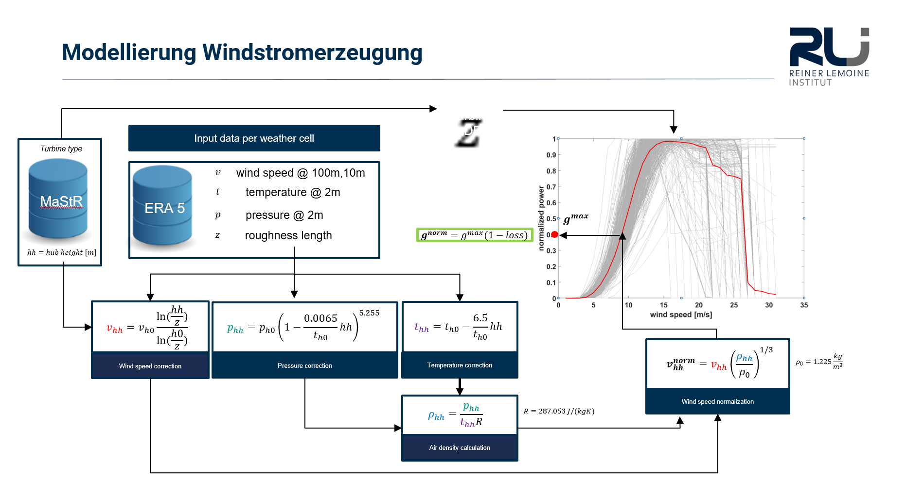
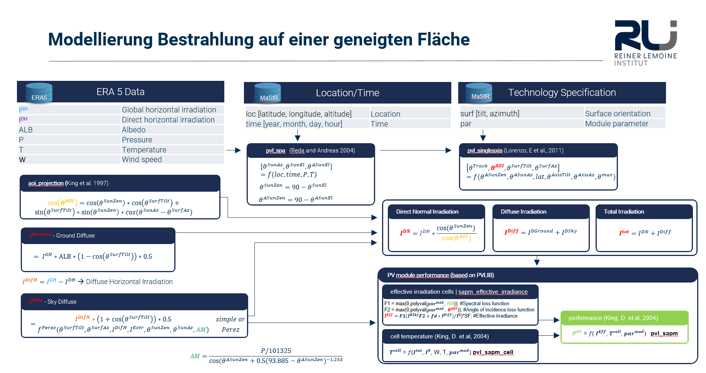

# GermanRenewableEnergy
Model renewable energy power for all german solar panels and wind turbines.

The capacity factor is calcuted for all german solar panels and wind wind turbines for each hour in all set years (2000-2023).
The calculation is described in chapter [Wind.py](#Wind.py) and [Solar.py](#Solar.py).

The Solar panels and wind wind turbines data is downloaded once from [MaStr](https://www.marktstammdatenregister.de/MaStR) using OpenMaStr.
and ERA5-Wheater downloaded once during installation.


## :wrench: Installation and setup environment

Follow the steps [here](/docs/setup_and_install.md) to setup the project.

## :running: Run the programm

See [here](/docs/run.md) how to execute the software with the correct parameters.

## Project structure

### General structure

Key
```
| link | meaning          |
|------|------------------|
| ...> | information flow |  
| ---> | data flow        |  
| ---  | connected with   | 
```




```mermaid
flowchart LR
    subgraph postgresql-db
    db[(kfw-mastr)]
    db --- Calculation_solar
    db --- Calculation_wind
    db --- municipalities_geoboundaries
    db --- results_wind_hourly
    db --- results_solar_hourly
    db --- results_wind_monthly
    db --- results_solar_monthly
    db --- results_wind_yearly
    db --- results_solar_yearly
    
    end
    
    
    subgraph config[configyaml]
    conf_line["CALC_SOLAR
    SPECIFIC_SOLAR_UNITS
    CURTAILMENT_SOLAR

    CALC_WIND
    SPECIFIC_WIND_UNITS
    CURTAILMENT_WIND
    
    ...
    "]
    end


    subgraph extweatherdata[Weather data]
    ERA5db[(ERA5)]
    end

    subgraph extdata[External data]
    Markstammdatenregister[(Markstammdatenregister)]
    muncipalities[(Gemeinde Geodaten)]
    end


   

    results ==>  results_wind_hourly
    results ==>  results_solar_hourly
    results ==>  results_wind_monthly ==>  |"export_and_copy_files()"| output
    results ==>  results_solar_monthly ==>  |"export_and_copy_files()"| output
    results ==>  results_wind_yearly ==>  |"export_and_copy_files()"| output
    results ==>  results_solar_yearly ==>  |"export_and_copy_files()"|output


    config -.-> main(((main.py)))
    era5py(((era5.py))) -.-> |"download_era5_data()"| extweatherdata ===> hourly
    setupdb(((setup_database.py)))-.-> |"main()"|extdata ===> postgresql-db
    main -.-> |"calculate_cf_wind()"| calc_wind(((calculate_cf_wind.py))) -.-> |"load_era5_weather_wind()"|wind_w ==> wind_calculations{" "} ==> |"wind.calculate_power()"| results{"results"}
    main -.-> |"calculate_cf_solar()"| calc_solar(((calculate_cf_solar.py))) -.-> |"load_era5_weather_solar()"|solar_w ==> solar_calculations{" "}  ==> |"solar_calculations()"| results{"results"}
    calc_solar(((calculate_cf_solar.py))) -.-> |"load_calculation_solar_data()"| Calculation_solar ==> solar_calculations
    calc_wind(((calculate_cf_wind.py))) -.-> |"load_calculation_wind_data()"| Calculation_wind ==> wind_calculations 


    subgraph output
        csv[/CSVs\]
        config_out[/config_SOFTWARE_VERSION_OUTFILE_POSTFIX.yaml\]
        log[/kfw-mastr_SOFTWARE_VERSION_OUTFILE_POSTFIX.log\]
        
    end

    subgraph input
        subgraph era5
            subgraph hourly
            
            solar_w["10m_u_component_of_wind.nc
            10m_v_component_of_wind.nc
            surface_solar_radiation_downwards.nc
            total_sky_direct_solar_radiation_at_surface.nc
            surface_pressure.nc
            2m_temperature.nc
            near_ir_albedo_for_diffuse_radiation.nc"]


            wind_w["100m_u_component_of_wind.nc
            100m_v_component_of_wind.nc
            forecast_surface_roughness.nc
            surface_pressure.nc
            2m_temperature.nc"]

            end
        end

    end

    click main "https://github.com/chrwm/kfw-mastr/blob/main/main.py" _blank
    click conf_line "https://github.com/chrwm/kfw-mastr/blob/main/config.yaml" _blank
    click calc_wind "https://github.com/chrwm/kfw-mastr/blob/main/kfw_mastr/calculate_cf_wind.py" _blank
    click calc_solar "https://github.com/chrwm/kfw-mastr/blob/main/kfw_mastr/calculate_cf_solar.py" _blank
    click setupdb "https://github.com/chrwm/kfw-mastr/blob/main/kfw_mastr/setup_database.py#L867-L931" _blank
    click Markstammdatenregister "https://www.marktstammdatenregister.de/MaStR" _blank
    click muncipalities "https://daten.gdz.bkg.bund.de/produkte/vg/vg5000_1231/aktuell/" _blank
    click era5py "https://github.com/chrwm/kfw-mastr/blob/main/kfw_mastr/utils/era5.py" _blank
    click ERA5db "https://cds.climate.copernicus.eu/cdsapp#!/dataset/reanalysis-era5-single-levels" _blank
    click solar_calculations "https://github.com/chrwm/kfw-mastr/blob/259e1606cd9ea5b6e278f61ed3bb3414f6ecc74a/kfw_mastr/solar.py#L58-L108" _blank
    click wind_calculations "https://github.com/chrwm/kfw-mastr/blob/259e1606cd9ea5b6e278f61ed3bb3414f6ecc74a/kfw_mastr/wind.py#L141-L185" _blank
```

# Methodological background

## ERA5 weather data

Find information about weather parameters in [ERA5 data documentation](https://confluence.ecmwf.int/display/CKB/ERA5%3A+data+documentation) and information about the grid in [ERA5 grid documentation](https://confluence.ecmwf.int/display/CKB/ERA5%3A+What+is+the+spatial+reference).

```
| calcType | count | name                                        | units   | variable name in CDS                        | shortName | paramID |
|----------|-------|---------------------------------------------|---------|---------------------------------------------|-----------|---------|
| wind     | 71    | 100 metre U wind component                  | m s**-1 | 100m_u-component_of_wind                    | 100u      | 228246  |
| wind     | 72    | 100 metre V wind component                  | m s**-1 | 100m_v-component_of_wind                    | 100v      | 228247  |
| wind     | 69    | Forecast surface roughness                  | m       | forecast_surface_roughness                  | fsr       | 244     |
| wind     | 39    | Surface pressure                            | Pa      | surface_pressure                            | sp        | 134     |
| wind     | 48    | 2 metre temperature                         | K       | 2m_temperature                              | 2t        | 167     |
| solar    | 46    | 10 metre U wind component                   | m s**-1 | 10m_u_component_of_wind                     | 10u       | 165     |
| solar    | 47    | 10 metre V wind component                   | m s**-1 | 10m_v_component_of_wind                     | 10v       | 166     |
| solar    | 6     | Surface solar radiation downwards           | J m**-2 | surface_solar_radiation_downwards           | ssrd      | 169     |
| solar    | 23    | Total sky direct solar radiation at surface | J m**-2 | total_sky_direct_solar_radiation_at_surface | fdir      | 228021  |
| solar    | 39    | Surface pressure                            | Pa      | surface_pressure                            | sp        | 134     |
| solar    | 48    | 2 metre temperature                         | K       | 2m_temperature                              | 2t        | 167     |
| solar    | 4     | Near IR albedo for diffuse radiation        | (0 - 1) | near_ir_albedo_for_diffuse_radiation        | alnid     | 18      |
```

## Download ERA5 weather data via API

Follow this [manual](/docs/download_era5.md) to download new weather data.

## Wind.py

Formulas implemented in wind.py



## Solar.py

Formulas implemented in solar.py



# License (Code)

This repository is licensed under the **GNU Affero General Public License v3.0 or later** ([AGPL-3.0-or-later](https://www.gnu.org/licenses/agpl-3.0.txt)).
See [LICENSE](LICENSE) for rights and obligations.
Copyright: © [Reiner Lemoine Institut](https://reiner-lemoine-institut.de) © KfW
